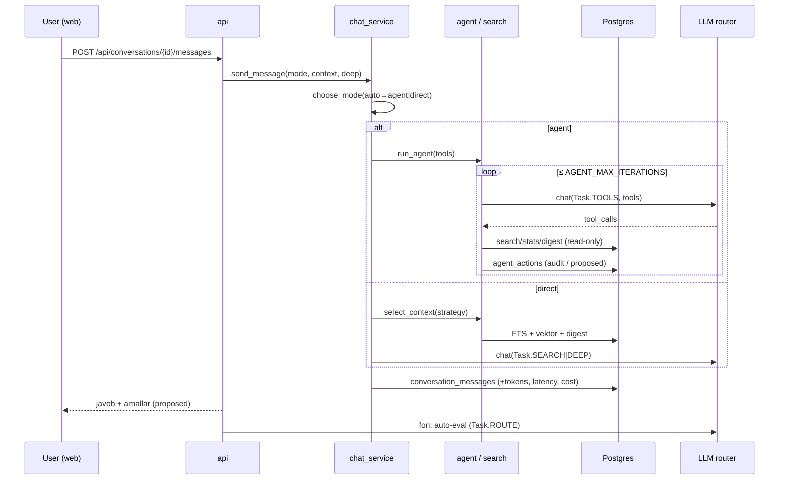

# Arxitektura

## Komponentlar

```mermaid
flowchart LR
  subgraph User
    B[Brauzer / Mini App]
    TG[Telegram bot chat]
  end
  subgraph App["docker compose"]
    API[api · FastAPI\n/login /chat /dashboard /api/*]
    BOT[bot · aiogram]
    W[worker · ARQ\nsync · snapshot · digest · embed]
    PG[(Postgres 16\n+ pgvector)]
    R[(Redis)]
  end
  subgraph External
    MT[Telegram MTProto]
    LLM[Claude · Gemini · DeepSeek\n(app.llm fasadi)]
  end
  B --> API
  TG --> BOT
  API --> PG
  API --> R
  API --> MT
  API --> LLM
  W --> PG
  W --> R
  W --> MT
  W --> LLM
  BOT --> PG
```

* **api** — Web UI + JSON API. Telefon orqali login (auth oqimlari jarayon
  xotirasida → bitta uvicorn worker), AI chat, dashboard, yozish amallarini
  tasdiqlash. MTProto'ga faqat o'qish uchun (`mtproto/pool.py`) va tasdiqlangan
  yozish uchun (`services/actions.py`).
* **worker** — ARQ ishlari: `sync_account`, `sync_chat`, `snapshot_metrics`
  (har soat), `incremental_sync_all` (10 daq), `embed_messages` (15 daq),
  `build_daily_digests` (kechasi). `max_jobs = 4` — flood-wait uchun.
* **bot** — boshqaruv boti (0-bosqich skeleti: /start, til). Boshqaruv boti
  peer deny-list'da — agent unga hech qachon yozmaydi.
* **Postgres** — hamma holat: akkauntlar (shifrlangan session), chatlar,
  xabarlar (media yo'q), snapshot vaqt qatori, embedding'lar, digest keshi,
  suhbatlar, audit.
* **Redis** — ARQ navbati va bot FSM.

## Ma'lumot oqimi — AI chat



## Katalog xaritasi

```
src/app/
  config.py            barcha env → Settings (yagona manba)
  logging.py           structlog + sirlarni maskalash
  crypto/envelope.py   session'lar uchun envelope encryption
  mtproto/
    allowlist.py       TL metod deny-by-default (DENIED / INTERNAL / AUTH / READ / WRITE)
    guard.py           peer deny-list (assert_writable)
    client.py          GuardedTelegramClient — har TL so'rov allowlist'dan o'tadi
    pool.py            ulangan akkauntlar klient pool'i (faqat o'qish yordamchilari)
  llm/
    base.py, router.py provider fasadi, Task → provider/model, capability fallback
    claude.py          anthropic SDK (API key / Claude Code token / profil)
    claude_code.py     `claude -p` subprocess (Claude Code sessiyasi, tool'siz)
    gemini.py, deepseek.py, pricing.py
  services/
    auth_flow.py       telefon → kod → 2FA holat mashinasi
    session_store.py   session seal/unseal
    accounts.py        login natijasini User/Account'ga bog'lash
    ingestion.py       chat registry, tarix sync, snapshot
    digests.py         kunlik digest keshi
    search.py          FTS/trgm/vektor, RRF, kontekst strategiyalari, byudjet
    analytics.py       chat statistikasi (LLM'siz)
    prompts.py         barcha system prompt'lar
    tools.py           read-only agent tool'lari
    write_tools.py     yozish tool'lari (faqat taklif)
    actions.py         tasdiqlash / rad / bajarish, per-chat rejim
    agent.py           tool sikli (byudjetlar, audit)
    chat_service.py    AI chat orkestratsiyasi (rejim, kontekst, saqlash)
    evaluation.py      👍/👎 + LLM-judge
    stats.py           dashboard agregatlari
  web/
    main.py, security.py (cookie, CSRF, locale)
    routers/ auth, tg, chat, actions, stats, pages
    templates/ login, chat, dashboard · static/ app.css, md.js, chat.js, dashboard.js, vendor/mermaid
  worker/  settings.py (cron), tasks.py, queue.py
  bot/     aiogram handlerlar (skelet)
  i18n/    uz / ru / en
migrations/            Alembic 0001–0005
```

## Bosqichlar holati

| # | Bosqich | Holat |
|---|---|---|
| 0 | Skeleton, DB, guardrail, crypto, i18n, LLM qatlami | ✅ |
| 1 | Auth: telefon → kod → 2FA (web), multi-account | ✅ (QR login ⬜) |
| 2 | Ingestion: registry, tarix sync, snapshot cron, incremental | ✅ (real-time listener ⬜) |
| 3 | Qidiruv: FTS+trgm+pgvector, strategiyalar, digest keshi | ✅ |
| 4 | Statistika: `analytics.chat_stats` (tool orqali) | 🟡 rollup jadvali ⬜ |
| 5 | Agent v1 (read-only tool'lar, prompt'lar, byudjetlar) | ✅ |
| 6 | Write actions + tasdiqlash UI | ✅ |
| 7 | Kontent: rasm generatsiya, scheduling UI, auto-reply | ⬜ |
| 8 | Polish: monitoring, limitlar, yuk testi | ⬜ |
