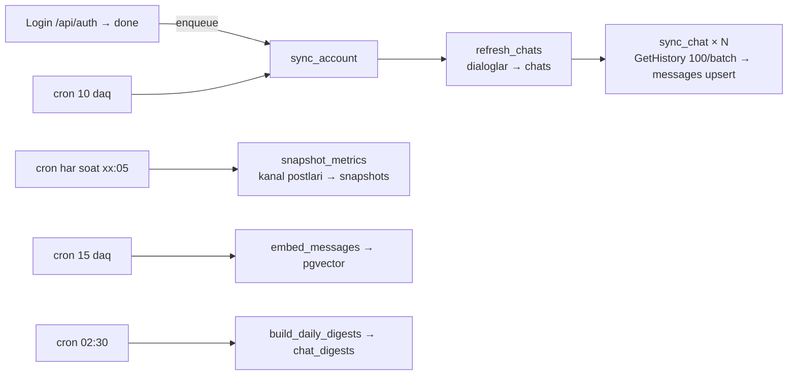

# Ingestion

Barchasi **faqat o'qish** (allowlist `READ`), `services/ingestion.py` +
`worker/tasks.py`.

## Tarix sync (`sync_chat`)

1. yangi xabarlar: `min_id = synced_max_id` (incremental);
2. orqaga to'ldirish: `offset_id = synced_min_id` — `synced_min_id == 1` bo'lguncha;
3. har 100 talik batch DB'ga darhol (`INSERT … ON CONFLICT (chat_id, tg_msg_id)`),
   progress `synced_total / total_estimate` (`chats` jadvalida, UI badge).

Ban riski: `WAIT_BETWEEN_BATCHES = 0.7 s`, Telethon `flood_sleep_threshold=60`;
undan uzun FloodWait → `SyncPaused` → ish to'xtaydi, `sync_error` yoziladi,
o'zini `retry_after + 5 s` bilan qayta navbatga qo'yadi. **Ramp-up**: akkaunt
24 soatdan yosh → ≤1000 xabar × 20 chat. Job id deterministik (`sync:acc:<id>`)
— akkauntga parallel sync yo'q. Worker restart'da `running` qolganlar `idle`.

## Snapshot (4.6-band)

Faqat kanallar; `snapshot_tiers(hour)`: <24 soat — har soat; 1-7 kun — har 6
soat; 7-90 kun — kuniga (03:00). `channels.GetMessages` batch 100 →
`message_metric_snapshots` + `messages.views` yangilanadi. **Cron'ni o'chirmang.**

## Digest keshi

`services/digests.py`: kun bo'yicha `Task.ROUTE` bilan ~150 so'zli digest;
`< 4` xabarli kunlar xom; savolda yo'qlari hisoblanib yoziladi, kechasi kechagi
kun oldindan; `msg_count` farq qilsa qayta.

## Embedding

`embed_messages`: sinxron chatlar, matn ≥20 belgi, batch 100, `EMBED_ENABLED`.
Vektor qidiruv faqat embedding bor chatlarda; yo'q bo'lsa FTS+trgm.

## Cheklovlar / keyingi qadam
Real-time update listener yo'q (10 daqiqalik incremental cron). Kunlik rollup
jadvali (4-bosqich) hali to'ldirilmaydi — statistika `analytics.chat_stats`
to'g'ridan-to'g'ri `messages`/`snapshots` ustidan.
